<p align="center">
  
</p>

<h1 align="center">
LINCA (Link Campus)
</h1>

<p align="center">
A secure web-based marketplace connecting university students across Jordan,
allowing them to showcase, sell, and purchase student-made products in a trusted environment.
</p>

<p align="center">

🎓 Student Marketplace • 🛒 E-Commerce • 🔐 Secure Authentication • 🏪 Multi-Role Platform

</p>

---

# 📖 Overview

LINCA (Link Campus) is a web-based marketplace developed to empower university students in Jordan by providing a dedicated platform where they can showcase, promote, and sell their products and services.

The platform creates a trusted environment by verifying student sellers through their university email addresses and requiring administrative approval before activating seller accounts.

LINCA supports communication between buyers and sellers, secure product management, organized stores, order processing, and multiple user roles while maintaining transparency, quality, and ease of use.

The project was developed using **ASP.NET Core MVC**, **Entity Framework Core**, **SQL Server**, and **ASP.NET Identity**, following modern software engineering principles.

---

# ✨ Key Features

- User Registration & Login
- Secure Authentication using ASP.NET Identity
- University Email Verification
- Multi-Role System
- Seller Upgrade Requests
- Admin Approval Workflow
- Student Stores
- Product Management
- Shopping Cart
- Order Management
- Store Management
- Product Categories
- University-Based Marketplace
- Public Buyer Support
- Responsive User Interface
- Administrative Control Panel

---

# 👥 User Roles

## 👤 Guest

A guest can:

- Browse the home page.
- View available universities.
- Explore student stores.
- Browse available products.
- Register a new account.
- Login securely.

---

## 👥 Customer

After signing in, customers can:

- Browse stores from different universities.
- Search products.
- View detailed product information.
- Add products to the shopping cart.
- Place orders.
- Track their orders.
- Update account information.
- Submit a request to become a seller.

---

## 🛍 Seller

Once the seller request is approved by the administrator, the user becomes a Seller and can:

- Create and manage a personal store.
- Add new products.
- Edit existing products.
- Delete products.
- Receive customer orders.
- Update order status.
- Manage store information.
- Offer products and services.
- Communicate with customers through the platform.

---

## 🛠 Admin

The administrator has full control over the platform and can:

- Review seller requests.
- Approve or reject seller applications.
- Monitor stores.
- Manage products.
- Manage users.
- Monitor platform activity.
- Maintain marketplace quality.
- Ensure platform integrity and security.

---
# 📸 Screenshots

## Shared Pages

### Welcome Page

Displays the landing page where users can explore the platform and access authentication features.

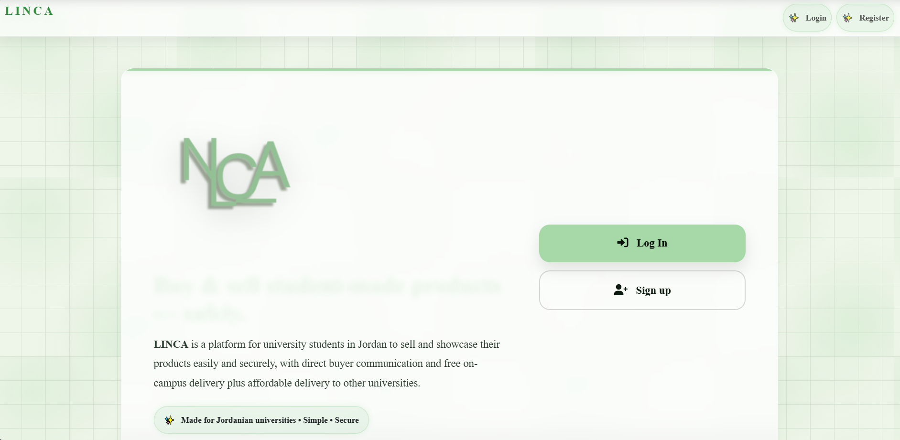
---

### Login

Secure authentication page for registered users.

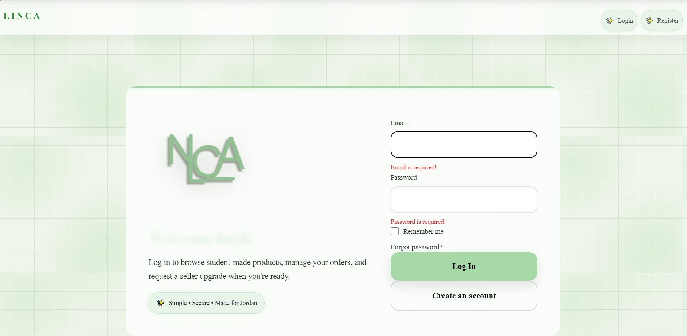

---

### Register

Allows new students to create an account using their university email.

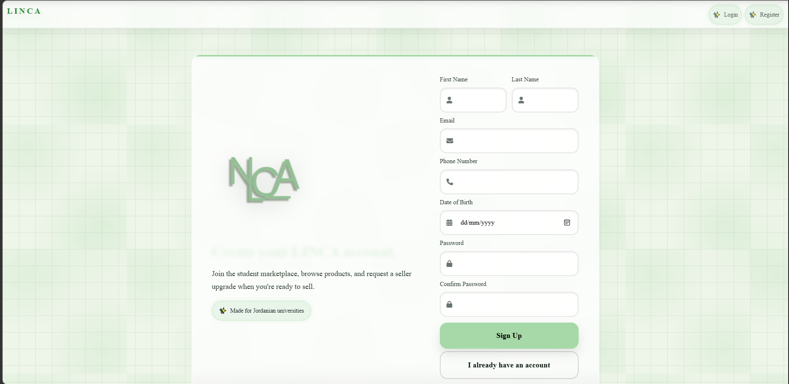


---

---

# 👤 Customer Screenshots


---

### Product Details

<p align="center">
  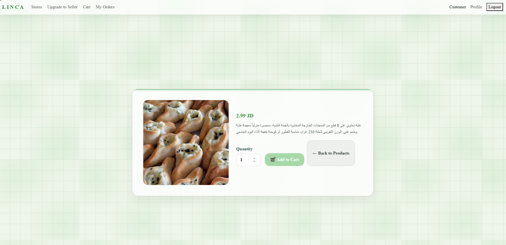
</p>

---

### Shopping Cart / Orders

<p align="center">
  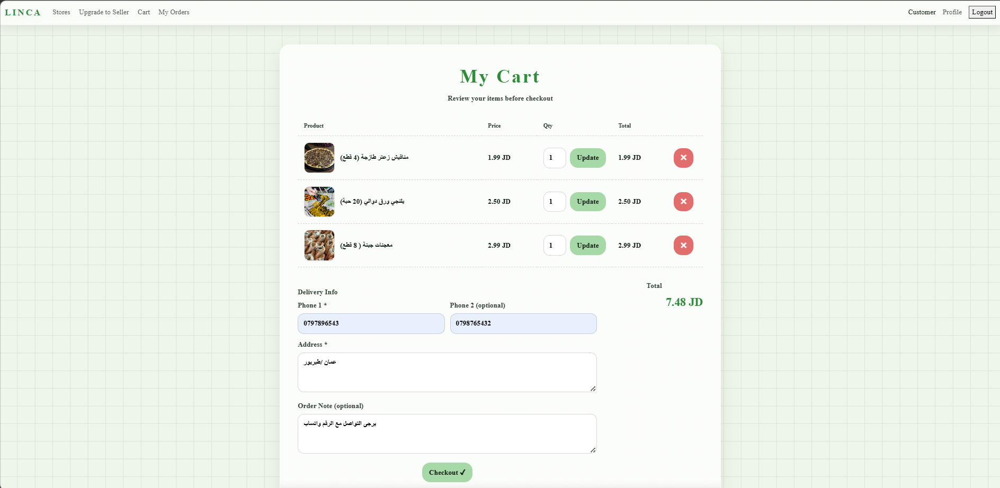
</p>
---
### Customer Dashboard

<p align="center">
  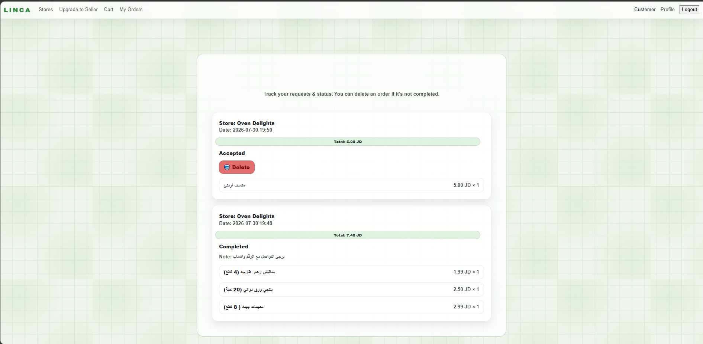
</p>


---

# 🛍 Seller Screenshots

### Seller Dashboard

<p align="center">
  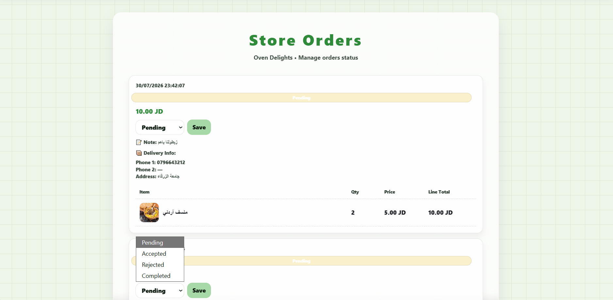
</p>

---

### Add Product

<p align="center">
  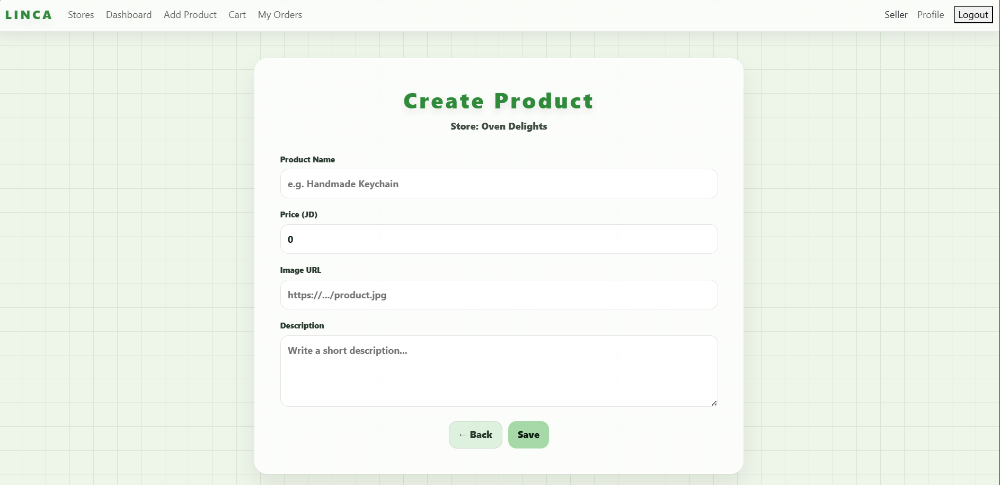
</p>

---

### Product Management

<p align="center">
  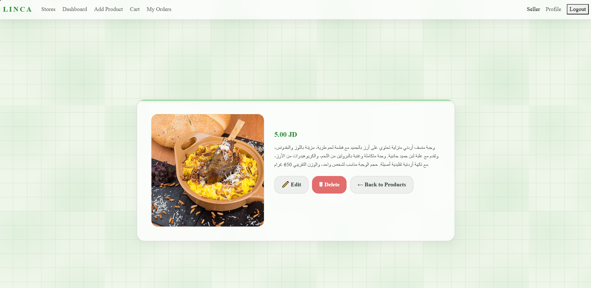
</p>


---

# 🛠 Admin Screenshots

### Admin Dashboard

<p align="center">
  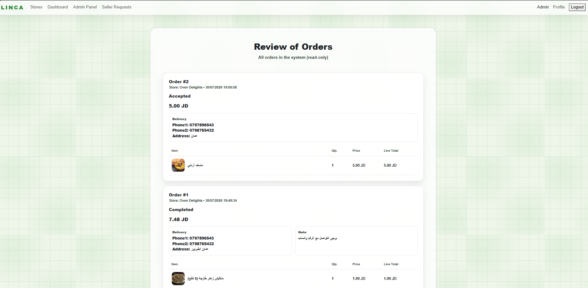
</p>

---

### Seller Requests Management

<p align="center">
  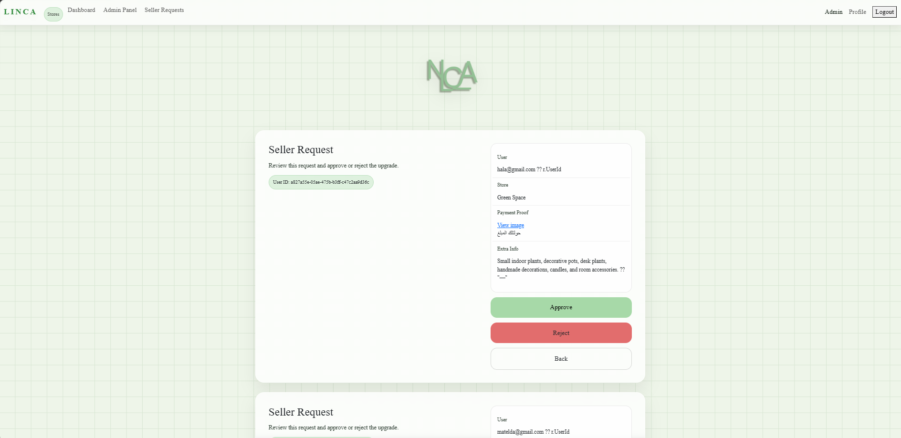
</p>

---

### User Management

<p align="center">
  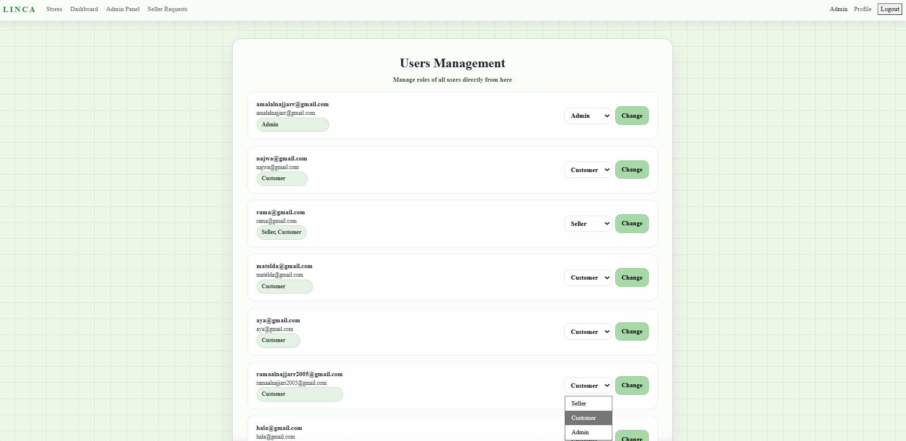
</p>

# 🔄 System Workflow

1. A student creates an account.
2. The student browses the marketplace as a customer.
3. The student submits a Seller Request.
4. The administrator reviews the request.
5. If approved, the user's role changes to Seller.
6. The seller creates a personal store.
7. Products are added to the store.
8. Customers browse products.
9. Customers place orders.
10. Sellers manage incoming orders.
11. Administrators monitor and manage the entire platform.

---
---

# 🛠 Technologies Used

The project was developed using the following technologies:

### Backend

- ASP.NET Core MVC
- C#
- Entity Framework Core
- ASP.NET Identity

### Database

- SQL Server

### Frontend

- HTML5
- CSS3
- Bootstrap
- JavaScript

### Development Tools

- Visual Studio 2026
- SQL Server Management Studio (SSMS)
- Git
- GitHub

---

# 📂 Project Structure

```text
LINCA
│
├── Controllers
├── Models
├── Views
├── ViewModels
├── Services
├── Validations
├── Migrations
├── wwwroot
├── Properties
├── appsettings.json
├── Program.cs
└── LINCA.sln
```

The project follows the **Model–View–Controller (MVC)** architecture to ensure clean code organization, maintainability, and scalability.

---

# 🚀 How to Run the Project

## Requirements

Before running the project, make sure you have:

- Visual Studio 2026 (or Visual Studio 2022 with ASP.NET workload)
- SQL Server
- SQL Server Management Studio (optional)
- .NET SDK
- Git (optional)

---

## Installation Steps

### 1. Clone the repository

```bash
git clone https://github.com/ramaalnajjarr2/LINCA.git
```

Or download the project as a ZIP file from GitHub.

---

### 2. Open the project

Open the `LINCA.sln` solution using Visual Studio.

---

### 3. Restore NuGet packages

Visual Studio usually restores the required packages automatically.

If not, restore them manually and wait until all dependencies are installed.

---

### 4. Build the solution

From the menu:

```
Build → Rebuild Solution
```

---

### 5. Create the database

Open:

```
Tools → NuGet Package Manager → Package Manager Console
```

Run:

```powershell
update-database
```

Entity Framework Core will automatically create the database using the configured migrations.

---

### 6. Run the project

Press:

```
F5
```

or click:

```
Start Debugging
```

The application will open automatically in your browser.